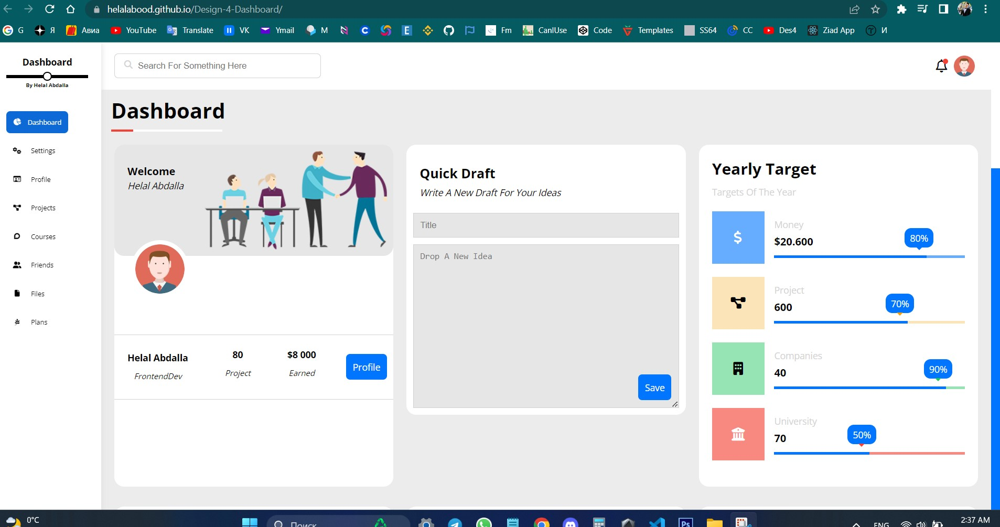
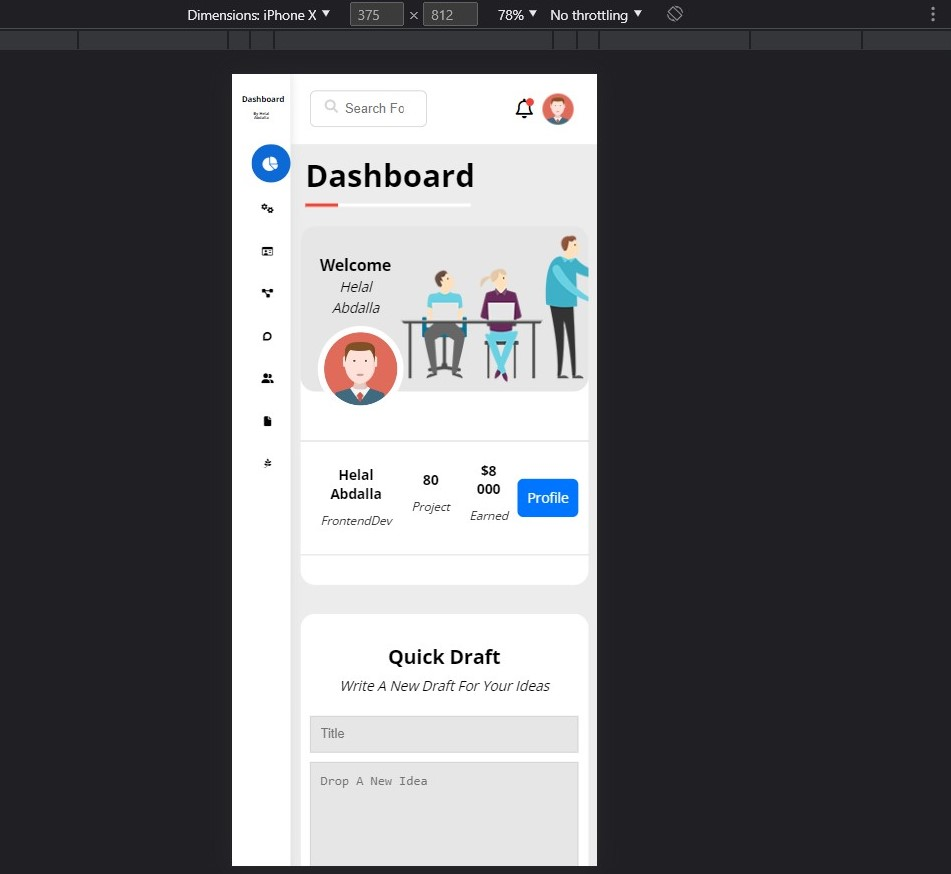

"Hello, World! Thanks for watching my 4-rd design, hope you like it"

# Demo: https://helalabood.github.io/Design-4-Dashboard/

### Screenshot

About The Project

## What's new over this design: 
        ###### Font-Family
        'Open Sans', sans-serif

- Creating my own framework (using classes)
- Doing an sidebar (on the fly) / an stack side on responsive-mobile
- Added an animation on logo via psudo elements
- Main h1 for each page
- Scrollbar width, tracka and thumb
- Fixed ul on sidebar
- Using 'initial' 
- Animation using in pusdo elements
- Toggle-checkbox & toggle-switch
- Focus-within
- Resizing the grid system on special pages 

// Next updates: 
- Retouching with JS
 

More About Me:
- GitHub [@HelalAbood](https://github.com/HelalAbood)
- [Facebook](https://www.facebook.com/abooodhlal/)
- [Email](stavuo.2010@ymail.com)
